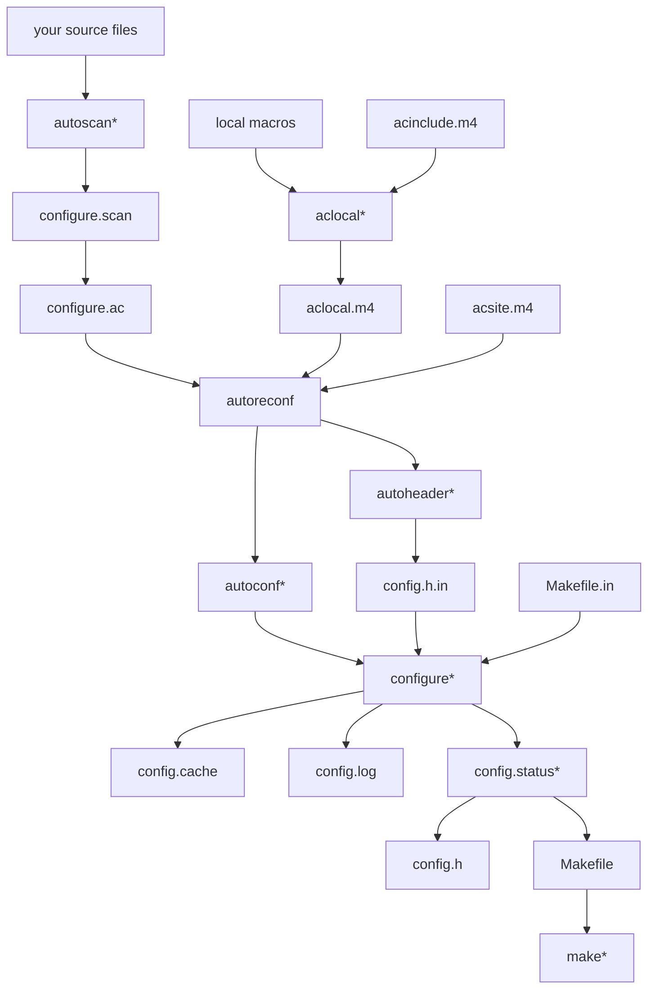

# Instructions

To render Mermaid in github hosted markdown files:

1. Create a repo with the markdown file
2. Wrap the code in a ```mermaid {}``` block:

> Note: This does not work in gists 🥲

# Example 

The following markdown code:

    ```mermaid
    graph 
        A["your source files"] --> B["autoscan*"] --> C["configure.scan"] --> D["configure.ac"] --> X
        E["local macros"] --> F["aclocal*"] --> G["aclocal.m4"] --> X["autoreconf"]
        H["acinclude.m4"] --> F
        I["acsite.m4"] --> X
        X --> J["autoconf*"] --> K["configure*"]
        X --> L["autoheader*"]  --> M["config.h.in"] --> K
        N["Makefile.in"] --> K
        K --> P["config.cache"]
        K --> Q["config.log"]
        K --> O["config.status*"] --> R["config.h"]
        O --> S["Makefile"] --> T["make*"]
    ```

Becomes this diagram:


