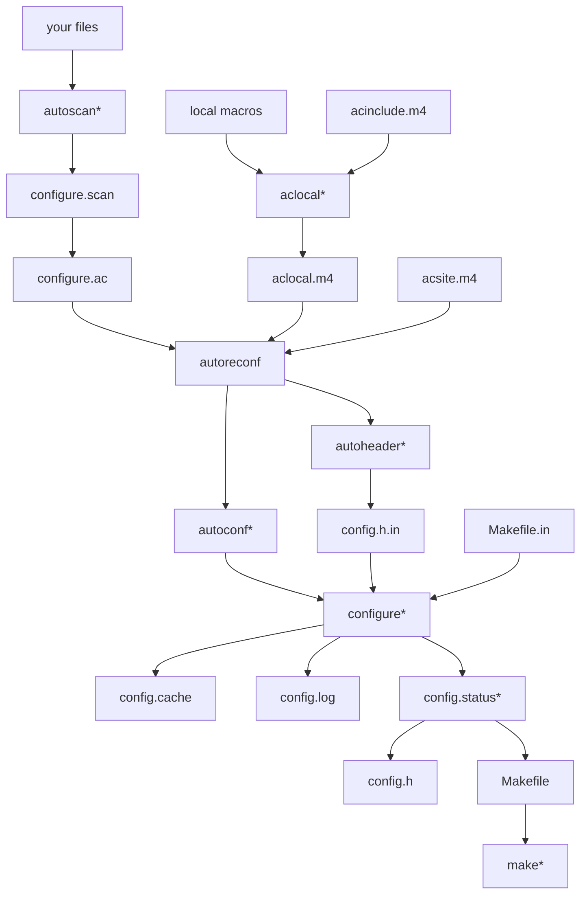

# Instructions

To render Mermaid in github hosted markdown files:

1. Create a repo with the markdown file
2. Wrap the code in a ```mermaid {}``` block:

> Note: This does not work in gists 🥲

# Example 

The following markdown code:

    ```mermaid
    graph 
        A["your files"] --> B["autoscan*"] --> C["configure.scan"] --> D["configure.ac"] 
        
        E["local macros"] & F["acinclude.m4"] --> G["aclocal*"] --> H["aclocal.m4"]

        D["configure.ac"] & H["aclocal.m4"] & I["acsite.m4"] 
            --> J["autoreconf"]
        --> K["autoconf*"] & L["autoheader*"]

        L["autoheader*"]  --> M["config.h.in"]

        K["autoconf*"] & M["config.h.in"]  & N["Makefile.in"]
            --> O["configure*"] 
        --> P["config.cache"] & Q["config.log"] & R["config.status*"]

        R["config.status*"] --> S["config.h"] & T["Makefile"]

        T["Makefile"] --> U["make*"]
    ```

Becomes this diagram:


